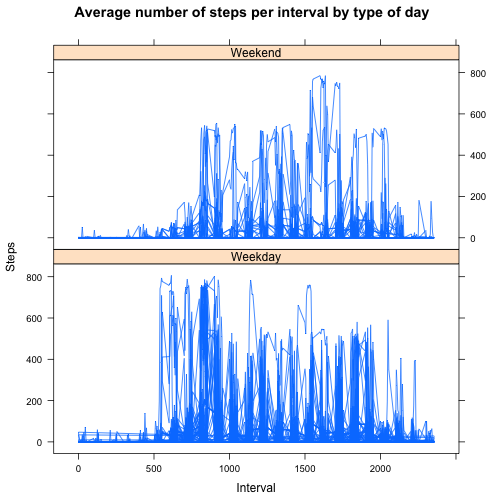

# PA1_template


```r
library(knitr)
library(markdown)
options(markdown.HTML.options = "")
opts_chunk$set(fig.path = "figures/" )
```

This is an R Markdown document that will descrbe the analysis of data from a personal activity monitoring device.

##Loading and preprocessing the data
Once the appropriate working directory is set, the data is loaded into R and named 'dat'.


```r
#Setting the working directory
setwd("~/Documents/Sync/Coursera/Reproducible Research/Assignment 1")
#Read in data from the provided .csv file into R
dat <- read.csv('activity.csv')
#Convert dates from factors to dates
dat$date <- as.Date(as.character(dat$date), "%Y-%m-%d")
```

##What is mean total number of steps taken per day?

Histogram of total steps taken per day:


```r
#Take the sum of the number of steps for each date included in the data set
dat_no_na <- na.omit(dat)
steps_per_day <- aggregate(steps ~ date, data = dat_no_na, sum)
#Create a histogram of the number of steps for each day
plot(steps_per_day, 
     type = 'h', 
     xlab = 'Date', 
     ylab = 'Number of Steps', 
     main = 'Number of steps per day' )
```

 

```r
#Calculate the mean and median number of steps taken per day
mean_steps <- mean(steps_per_day$steps)
median_steps <- median(steps_per_day$steps)
```

The mean number of steps taken per day is 10766, and the median number of steps taken per day is 10765. 

##What is the average daily activity pattern?


```r
#Take the mean number of steps avergaed per interval
int_mean <- aggregate(steps ~ interval, data = dat, mean)
#Creates a time series plot
plot(int_mean, type = 'l')
```

 

```r
#Finds the interval with the maximum number of steps
row_max <- apply(int_mean, MARGIN = 2, function(x) max(x, na.rm=TRUE))
step_max <- as.numeric(row_max[1])
```

The maximum number of steps in a given interval averaged over all days was 2355.

##Imputing misssing values


```r
#Calulate the number of missing values, and output as a numeric
num_na <- colSums(is.na(dat))
num_na_out <- as.numeric(num_na[1])
#changing column names in int_mean to differentiate from dat
colnames(int_mean) <- c('interval', 'avg_steps')

#merge average value per interval onto full data
dat_merge <- merge(dat, int_mean, by = 'interval')
#replace NAs in dat_merge with the average interval number of steps
dat_merge$steps[is.na(dat_merge$steps)] <- dat_merge$avg_steps[is.na(dat_merge$steps)]

#new dataset with imputed data and in the form of the original data
dat_new <- dat_merge[, c(2, 3, 1)]
dat_new <- dat_new[order(dat_new$date), ]

steps_per_day_impute <- aggregate(steps ~ date, data = dat_new, sum)
#Create a histogram of the number of steps for each day
plot(steps_per_day_impute, 
     type = 'h', 
     xlab = 'Date', 
     ylab = 'Number of Steps', 
     main = 'Number of steps per day with imputed values' )
```

 

```r
mean_steps_i <- mean(steps_per_day_impute$steps)
median_steps_i <- median(steps_per_day_impute$steps)
```

The total number of 'NA' values is 2304.

After imputing averge interval steps for missing data, the mean number of steps taken per day is 10766, and the median number of steps taken per day is 10766. These can be compared to the mean and median steps without imputation: Mean: 10766, median: 10765.

##Are there differences in activity patterns between weekdays and weekends?


```r
#Add a new column that defines whether the date is a weekend or weekday
dat_new$day <- c("Weekend", "Weekday", "Weekday", "Weekday", "Weekday", "Weekday", "Weekend")[as.POSIXlt(dat_new$date)$wday + 1]
dat_new$day <- as.factor(dat_new$day)

library(lattice)

xyplot(dat_new$steps~dat_new$interval|dat_new$day, 
       type = 'l',
       xlab = 'Interval',
       ylab = 'Steps',
       main = 'Average number of steps per interval by type of day',
       layout = c(1, 2))
```

 
